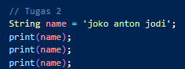

Kuis 1 Pemrograman Mobile Polinema

Dikerjakan Oleh : Agilar Gumilar

Kelas           :TI 3G

NIM             : 2141720106

Langkah 1

Soal :

Penjelasan :

Pada syntak diatas merupakan perintah menampilkan sesuatu(print). Print merupakan perintah untuk menampilkan text dengan berbagai format.

Langkah 2

Soal :

Penjelasan :

Langkah 2 merupakan proses inisialisasi tipe data string dengan value = 'joko anton jodi' sehingga ketika di print sebanyak 3 kali maka tampilan seperti saya lampirkan.

Langkah 3 

Soal :

Penjelasan :
Langkah 3 sebenarnya mirip dengan langkah 2, namun 'final' merupakan bentuk dari string yang tidak dapat diperbarui. Sehingga setelah diinisialisai maka value tidak akan bisa dirubah.

Langkah 4

Soal :

Penjelasan :

Pada perintah diatas merupakan proses inisialisasi array1 dan array2. Disitu sayang mengganti dari final ke var karena dibawah proses inisialisasi masih ada proses perubahan value. Alasan yang sama kenapa const.

Langkah 4.2

Soal: 

Penjelasan : 

Menurut saya yang bisa dijelaskan selain pembuktian bahwa print dapat di gunakan untuk bilangan bulat, maupun bilangan desimal.

Langkah 5

Soal : 

Penjelasan :

Dari program diatas kita dapat memahami proses inisialisasi awal dan inisialisasi ulang value dari number dengan type data num yang sebenarnya tidak berbeda dari type data yang lain.

Langkah 6

Soal :

Penjelasan :

Proses diatas merupakan contoh inisialisasi variable baru dengan menggunakan variable yang ada.

Langkah 7

Soal : 

Penjelasan :

Dari perintah diatas kita belajar penggunaan \ sebagai karakter escape untuk menghindari error dalam penggunaan karakter.

Langkah 8 

Soal :

Penjelasan :

Kode diatas memberi contoh tentang macam macam cara inisialisasi untuk suatu variable.

Langkah 9 

Soal :

Penjelasan : 

Yang berbeda dari langkah 8 yaitu dalam inisialisasi name1 dimana ditambahkan " " untuk memberikan spasi. Di kasus lain untuk " " dapat diisi text apapun sebagai bentuk penambahan string ke suatu variabel.

Langkah 10 

Soal :

Penjelasan :

Di langkah no 10 mencontohkan penggunaan komentar panjang dalam dart.
